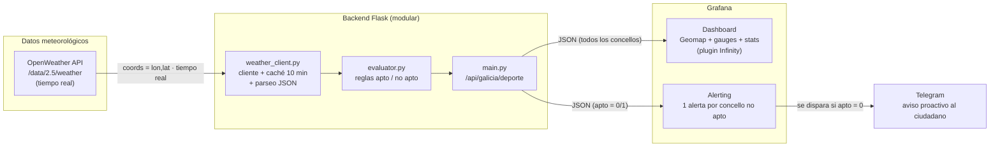

# 🎬 Santi & Go — Guion de demo + capturas para la presentación

> Objetivo: pitch de **~4 min** (comprimible a 3, ampliable a 5) que destaque
> **arquitectura de datos**, **API de OpenWeather en tiempo real** y el
> **sistema proactivo de alertas por Telegram**.
>
> **Pitch en una frase:** *Santi & Go convierte el tiempo en tiempo real
> de Galicia en una respuesta de una sola palabra —apto o no apto para deporte— y
> te avisa por Telegram sin que tengas que mirar ninguna gráfica.*

Las líneas en **🗣️** son una base para que las digas con tus palabras (en gallego o
castellano). Las **🖥️** son lo que enseñas en pantalla en ese momento.

---

## 1. Guion cronometrado

### ⏱️ [0:00 – 0:30] Gancho — el problema
**🗣️** «En Galicia todos hemos salido a correr con sol y vuelto empapados. La pregunta
*"¿hoy puedo entrenar al aire libre?"* parece tonta… hasta que el orballo te pilla a 3 km
de casa. Los datos para responderla **ya existen**: OpenWeather los publica en
tiempo real. El problema es que están en crudo. **Santi & Go** los convierte en una
respuesta de una sola palabra.»

**🖥️** Slide de portada con el nombre y el mapa de Galicia de fondo.

---

### ⏱️ [0:30 – 1:05] La solución y la arquitectura de datos
**🗣️** «Detrás hay una **arquitectura de extremo a extremo**, no un script suelto.
OpenWeather nos da la predicción; un **backend en Flask modular** la limpia, la interpreta y
**decide**; **Grafana** la cuenta visualmente; y **Telegram** la lleva al bolsillo del
ciudadano. Cuatro piezas, un único flujo de datos.»

**🗣️** «Una decisión de diseño de la que estamos orgullosos: un **único endpoint con dos
comportamientos** — devuelve *todos* los concellos para el mapa, o *uno solo* filtrado para
el detalle. Sin duplicar código, y listo para escalar a toda Galicia.»

**🖥️** Slide con el **diagrama de arquitectura** (sección 3 de este documento).

---

### ⏱️ [1:05 – 1:50] La API de OpenWeather en tiempo real
**🗣️** «Atacamos la **API de OpenWeather**, el endpoint
`/data/2.5/weather`, pidiendo temperatura, viento y precipitación por coordenadas.
El dato es la observación **actual**, así que de cada concello obtenemos la condición
más reciente. Nada de datasets estáticos: esto se actualiza solo.»

**🗣️** «Y lo tratamos como ingenieros de datos: **caché de 10 minutos** y peticiones **en
paralelo** para no saturar la API, **parseo defensivo** de la respuesta JSON, normalización de
unidades, y **degradación elegante** — si un concello falla, el resto sigue funcionando.»

**🖥️** Terminal con `python main.py` corriendo **y** un `curl` al endpoint devolviendo el
JSON con varios concellos (captura nº 8 del shot-list). Señala el campo `apto` y `actualizado`.

---

### ⏱️ [1:50 – 2:45] Demo en vivo — el dashboard
**🗣️** «Esto es lo que ve el usuario. Arriba elijo concello —pongo **A Coruña**— y los
indicadores se actualizan en directo: temperatura, viento, lluvia y el **veredicto**.»

**🖥️** En el dashboard, abre el desplegable **`$municipio`** y cambia de concello. Que se
vea cómo los gauges y el stat de "¿Apto?" cambian.

**🗣️** «Pero la joya es el **mapa de toda Galicia** de un vistazo. **Verde**: sal a entrenar.
**Rojo**: hoy mejor no. Esto es *storytelling*: no hace falta leer ni un número, el color ya
te lo dice. Y pasando el ratón tienes el detalle de cada concello.»

**🖥️** Haz zoom en el **Geomap**, pasa el ratón por un par de marcadores (uno verde, uno
rojo) para que salga el tooltip.

---

### ⏱️ [2:45 – 3:40] El clímax — alertas proactivas por Telegram
**🗣️** «Y aquí está el salto. Un dashboard está muy bien… pero **hay que abrirlo**. El reto
pedía explícitamente que *la ciudadanía no tenga que interpretar gráficas*. Así que nuestro
sistema es **proactivo**.»

**🗣️** «Cuando un concello pasa a *no apto*, Grafana dispara una alerta y te llega **esto** a
Telegram.»

**🖥️** Enseña el **móvil / grupo de Telegram** con el mensaje real:
*"⚠️ No apto para deporte en Ferrol — Lluvia"* (captura nº 5). Es el momento más potente: que
se vea llegar la notificación.

**🗣️** «Y no es un aviso genérico: es **una alerta por concello, con su nombre y su motivo**.
Técnicamente lo resolvimos con **alerta multidimensional** — la query devuelve `apto` como
única columna numérica y el nombre del concello como etiqueta, así una sola regla genera una
alerta por cada concello que lo necesite. **El ciudadano no entra a la plataforma: la
plataforma le avisa a él.**»

**🖥️** (Opcional, si da tiempo) Captura de la **regla de alerta** mostrando las columnas y el
umbral `apto < 1` (captura nº 6).

---

### ⏱️ [3:40 – 4:10] Impacto y cierre
**🗣️** «El impacto va más allá del *runner*: un colegio decidiendo si saca a los niños al
patio, o una persona mayor a la que el viento le supone un riesgo real. **Cero fricción,
cobertura global, y escalable** a los 313 concellos de Galicia cambiando una
lista de configuración.»

**🗣️** «**Santi & Go: el tiempo de Galicia, convertido en una decisión.** Gracias.»

**🖥️** Slide de cierre con el mapa + logo + un "verde = adelante".

---

## 2. Frases de cierre alternativas (elige la que más te suene)
- «De un dato en crudo a una decisión en el bolsillo. Eso es Santi & Go.»
- «No hacemos que mires el tiempo: hacemos que el tiempo te avise a ti.»
- «El clima de Galicia no se queda en un gráfico: llega a la gente.»

---

## 3. Diagrama de arquitectura (listo para el repo)

> Pega este bloque en el `README.md`: **GitHub renderiza Mermaid automáticamente.**

---

## 4. 📸 Shot-list — capturas clave (priorizadas)

| # | Captura | Qué debe verse | Dónde usarla | Por qué impresiona |
|---|---|---|---|---|
| **1** ⭐ | **Geomap de Galicia (hero)** | Mapa con marcadores verdes y rojos, al menos uno rojo visible, etiquetas de concello | **Cabecera del README** + slide solución | Es el "de un vistazo" del criterio *storytelling*. La foto que vende el proyecto. |
| **2** ⭐ | **Dashboard completo** | Cabecera + 3 stats + 3 gauges + Geomap, con un concello seleccionado | Slide de demo | Muestra el producto entero y que está pulido. |
| **3** | **Detalle de un concello** | Gauges (temp/viento/lluvia) + stat "❌ No Apto · Lluvia" | Slide de demo | Resultado legible y humano, no solo números. |
| **4** | **Desplegable `$municipio` abierto** | La lista de concellos desplegada | README (sección uso) + slide | Demuestra interactividad y escala regional. |
| **5** ⭐ | **Alerta en Telegram** | El grupo/móvil con "⚠️ No apto en Ferrol — Lluvia" recién llegado | **Slide clímax** + README (sección alertas) | EL valor del nivel avanzado: la capa que llega al ciudadano. |
| **6** | **Regla de alerta en Grafana** | Query A con columnas (`apto`=Number, `ciudad`/`recomendacion`=String) + umbral `IS BELOW 1` | Slide técnica + README | Prueba la complejidad técnica: el truco multidimensional. |
| **7** | **Contact point de Telegram** | Pantalla de configuración con "Test" en verde | Anexo técnico / README | Integración real, no maqueta. |
| **8** ⭐ | **Backend en marcha + `curl`** | Terminal con `python main.py` y la respuesta JSON con varios concellos | Slide arquitectura + README | Datos en tiempo real saliendo de TU API. |
| 9 | Editor de query Infinity | `Parser: Backend`, `Format: Table`, la URL del endpoint | Anexo técnico | Detalle de cómo se conecta Grafana a la API. |
| 10 | Estructura del repo | Árbol de carpetas (`app/`, `provisioning/`, etc.) | README | Transmite orden y arquitectura modular. |

**⭐ = imprescindibles.** Con 1, 2, 5 y 8 ya tienes una presentación sólida.

### 🎥 El extra que marca la diferencia: un GIF
Graba un **GIF de 10–15 s** (con ScreenToGif en Windows) que cuente toda la historia en bucle:
1. Cambias el concello en el desplegable → los gauges se actualizan.
2. Plano del Geomap con verdes y rojos.
3. Corte al móvil → llega la notificación de Telegram.

Ponlo **arriba del todo en el README**. Un GIF que muestra el dato fluyendo hasta Telegram
vale más que diez capturas estáticas.

---

## 5. ✅ Checklist "repo de 10"
- [ ] **Hero** arriba del README: el GIF (o la captura nº 1 del Geomap).
- [ ] **Diagrama de arquitectura** Mermaid (sección 3) en el README.
- [ ] Sección **"Cómo funciona"** corta: las 4 piezas (OpenWeather → Flask → Grafana → Telegram).
- [ ] **Capturas 5 y 6** en la sección de alertas (es tu diferenciador, que se vea).
- [ ] **Badges** simples arriba (Python, Flask, Grafana, License). Ya tienes el `LICENSE`.
- [ ] **Topics/tags** del repo en GitHub: `grafana`, `openweather`, `python`, `flask`,
      `open-data`, `telegram-bot`, `hackudc`.
- [ ] Enlace al **dashboard.json** y a `provisioning/` bien visibles (reproducibilidad).
- [ ] Un párrafo de **"Impacto y futuro"**: escalar a 313 concellos, perfiles por deporte/edad,
      añadir calidad del aire (la API también la tiene).
- [ ] Que el README **no exponga ningún token** (revisa que `.env` esté en `.gitignore` — ya lo está).

---

## 6. 🛡️ Q&A — preguntas probables del jurado (con respuestas cortas)

**"¿Por qué OpenWeather y no otra API meteorológica?"**
> **Cobertura global con un único contrato de API** y un **plan gratuito generoso** que cubre
> sin coste las llamadas de los 20 concellos con caché de 10 min. Para un MVP que debía estar
> funcionando ya, prioriza **fiabilidad y rapidez de integración** frente a la mayor resolución
> local que ofrecería una fuente oficial autonómica.

**"¿Cómo evitáis saturar la API con 20 concellos en cada refresco?"**
> **Caché de 10 minutos** por concello y peticiones **en paralelo**. Como la predicción es
> horaria, pedir más a menudo no aportaría nada.

**"¿Qué pasa si la API de OpenWeather falla?"**
> **Degradación elegante**: un concello caído se marca como no apto con el error, pero **no
> tumba el resto** de la respuesta ni el dashboard.

**"¿Es escalable a los 313 concellos de Galicia?"**
> Sí. Solo hay que añadir entradas en `config.py` y regenerar el `dashboard.json`. La
> arquitectura modular está pensada para eso.

**"¿Son datos en tiempo real de verdad?"**
> Sí: cada consulta pide la **observación meteorológica actual** de OpenWeather, no un dato
> pregrabado. El dashboard refresca cada 5 minutos.

**"¿Por qué Telegram y no una app propia?"**
> **Cero fricción**: el ciudadano ya lo tiene instalado, coste cero, y el reto valoraba
> bot de Telegram/Discord. Una app propia sería sobreingeniería para el MVP.

**"¿Y los falsos positivos / que esté siempre avisando?"**
> Umbrales **conservadores y centralizados** en `config.py`, fáciles de afinar, y el
> *pending period* de Grafana se puede subir para evitar parpadeos.

**"¿Vale para cualquier deporte?"**
> Los umbrales son configurables; el siguiente paso es **perfiles** (correr, ciclismo, mayores,
> niños) que ajusten viento/temperatura según el caso.
